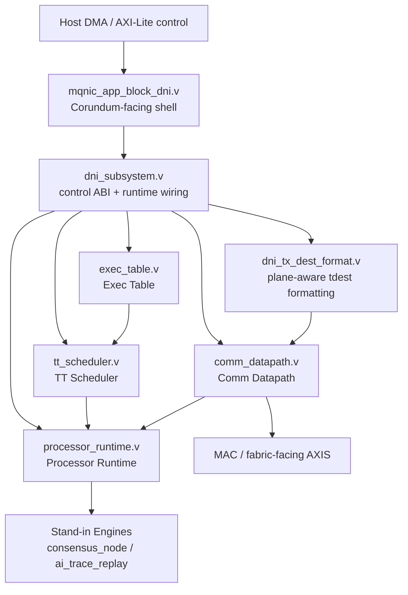

# Deterministic Network Interface (DNI)

This directory contains endpoint-side runtime components for Utopia's
deterministic network interface.

The DNI is not treated here as a generic SmartNIC feature set; it is the
runtime mechanism that enforces locally installed communication epochs against
the shared time base.

## Module Overview

Read the RTL in roughly this order:

1. `mqnic_app_block_dni.v`
2. `dni_subsystem.v`
3. `exec_table.v`
4. `tt_scheduler.v`
5. `processor_runtime.v`
6. `comm_datapath.v`
7. stand-in engines such as `consensus_node.v` and `ai_trace_replay.v`

`schedule_decode.v` remains in the tree as an older helper implementation, but
it is not part of the current paper-level architectural decomposition.

## Contents

- `program_fpga.sh`: helper script for programming FPGA images during
  development

Implementation substrates such as Corundum live under `platforms/` rather than
inside this runtime directory.

For the future-facing processor contract behind
[`processor_runtime.v`](rtl/core/processor_runtime.v), see
[`docs/processor_runtime_contract.md`](../../docs/processor_runtime_contract.md).
